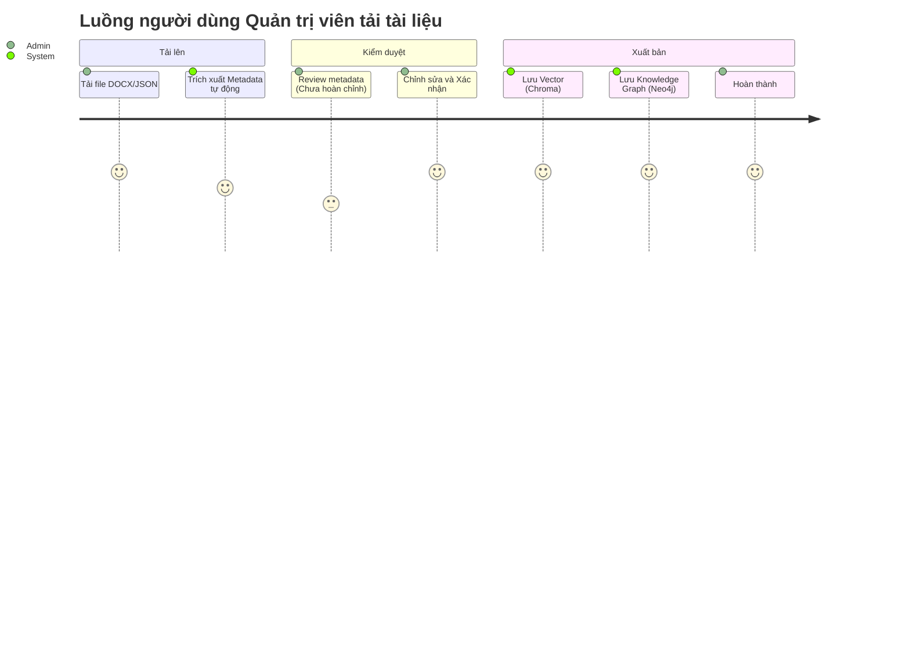

# Tổng quan Dự án: Legal Chatbot AI

Tài liệu này cung cấp cái nhìn toàn diện về kho mã nguồn của hệ thống **Legal Chatbot AI**, được phân tích từ ba góc nhìn: Kiến trúc sư Phần mềm (Software Architect), Lập trình viên (Software Developer), và Quản lý Sản phẩm (Product Manager).

---

## 1. Góc nhìn Kiến trúc sư Phần mềm (Software Architect)

Hệ thống được thiết kế theo mô hình **Client-Server** với backend dựa trên Python (Flask) đóng vai trò điều phối trung tâm, xử lý API và giao tiếp với một hệ sinh thái dữ liệu đa dạng (SQLite, Neo4j, Elasticsearch, ChromaDB). Khối logic cốt lõi bao gồm các luồng Xử lý Dữ liệu (Ingestion) và Truy xuất (Retrieval) dùng công nghệ RAG (Retrieval-Augmented Generation) và Knowledge Graph (Đồ thị Tri thức).

### Kiến trúc Hệ thống (System Architecture)

```mermaid
graph TD
    subgraph "Frontend Layer"
        UI[React/Vite Web App (Admin & Chat UI)]
    end
    
    subgraph "Backend API Layer (Flask)"
        Auth[Auth API]
        ChatAPI[Chat API]
        AdminAPI[Admin / Document API]
    end
    
    subgraph "Service & Logic Layer"
        DocSvc[Document Import Service]
        IndexSvc[Indexing Service]
        ChatSvc[Chat History Service]
        Retriever[Knowledge Graph / RAG Retriever]
        Ingester[LLM Chunking & Extraction]
    end
    
    subgraph "Data Storage & Search Engine"
        SQLite[(SQLite<br/>Metadata, Users, Chats)]
        Neo4j[(Neo4j<br/>Knowledge Graph)]
        ES[(Elasticsearch<br/>BM25 Fulltext)]
        Chroma[(ChromaDB<br/>Vector Store)]
    end
    
    subgraph "External AI Services"
        LLM[DeepSeek / OpenAI Compatible API]
    end

    UI -->|HTTP REST| Auth
    UI -->|HTTP REST| ChatAPI
    UI -->|HTTP REST| AdminAPI
    
    ChatAPI --> ChatSvc
    ChatAPI --> Retriever
    AdminAPI --> DocSvc
    
    DocSvc --> Ingester
    DocSvc --> IndexSvc
    
    Retriever --> LLM
    Retriever --> Neo4j
    Retriever -.-> ES
    Retriever -.-> Chroma
    
    Ingester --> LLM
    
    ChatSvc --> SQLite
    IndexSvc --> SQLite
    IndexSvc --> Neo4j
    IndexSvc --> ES
    IndexSvc --> Chroma
```

### Đánh giá Kiến trúc và Khả năng mở rộng
- **Kiến trúc Dữ liệu Đa tầng**: Việc tách biệt SQLite (lưu trữ metadata, thông tin user, lịch sử chat) khỏi các công cụ tìm kiếm (Neo4j cho graph, Elasticsearch cho từ khóa, ChromaDB cho vector) là một thiết kế xuất sắc cho RAG. Nó cho phép tìm kiếm linh hoạt (Hybrid search + Graph).
- **Module hoá Ingestion**: Quá trình import tài liệu (`Document Import Service`) được chia thành pipeline với các trạng thái rõ ràng (pending, uploaded, parsed, chunked, reviewed, published). Việc xử lý văn bản phức tạp (Word -> Text -> Chunking qua LLM -> Vector/Graph) được thiết kế có thể mở rộng (scalable).
- **Mở rộng (Scalability)**: Do việc xử lý RAG và chunking khá tốn tài nguyên, nếu tải tăng, phần `Ingestion` và `Retrieval` cần được tách thành microservices riêng (ví dụ dùng Celery / Redis queue) thay vì chạy trên Flask thread. Hiện tại `IndexingService` sử dụng `ThreadPoolExecutor` đơn giản, có thể là nút thắt cổ chai khi số lượng tài liệu lớn.

---

## 2. Góc nhìn Lập trình viên (Software Developer)

Dự án được tổ chức tốt, chia rõ ràng giữa Backend API, Frontend React, và Core Logic (`src`). 

### Cấu trúc Mã nguồn

- `backend/`: Chứa Flask API, định tuyến (routes), middlewares (auth decorators), và các tầng Service kết nối DB.
  - `api/`: Các Blueprint API (`admin_routes.py`, `chat_routes.py`, `auth_routes.py`).
  - `services/`: Chứa logic nghiệp vụ (`document_import_service.py`, `indexing_service.py`).
  - `models/`: Chứa logic thao tác SQLite (`database.py`, `sqlite_schema.sql`).
- `src/`: Chứa core logic cho AI / RAG.
  - `ingestion/`: Logic tách văn bản (`llm_splitter.py`), embed.
  - `retrieval/`: Logic truy vấn, đặc biệt là Text2Cypher (`retrieval.py` biến câu hỏi tự nhiên thành câu lệnh Cypher query Neo4j thông qua DeepSeek).
- `frontend/`: Giao diện ReactJS dùng Vite.
- `main.py`: CLI Tool phục vụ test ingestion, embedding, và test graph-retrieval mà không cần chạy backend.

### Điểm mạnh & Điểm cần lưu ý về Maintainability
- **Điểm mạnh**: Cấu trúc rõ ràng, áp dụng `dataclass` để định nghĩa model, code được type-hint (`typing`) khá đầy đủ trong các file mới, sử dụng Dependency Injection ở mức cơ bản thông qua class constructor. Cơ chế lưu trữ trạng thái Pipeline khi xử lý văn bản rất chặt chẽ, dễ debug.
- **Cần cải thiện (Technical Debt)**:
  - Text2Cypher Prompt trong `src/retrieval/retrieval.py` đang được xử lý bằng cách đọc file text (`prompts/text2cypher_prompt.txt`). Nên đưa vào cấu trúc quản lý prompt chuyên dụng như LangChain Hub hoặc một file cấu hình chung.
  - Các lỗi (Exceptions) đang được ném qua các Custom Class (`DocumentImportError`, `IndexingError`), đây là practice tốt, nhưng cần một Error Handler tập trung ở cấp độ Blueprint (Flask error handlers) để chuẩn hóa định dạng trả về.
  - Test coverage: Có thư mục `tests` nhưng cần đảm bảo luồng import tài liệu (rất phức tạp) được mock đầy đủ các kết nối DB và LLM.

---

## 3. Góc nhìn Quản lý Sản phẩm (Product Manager)

Hệ thống cung cấp một giải pháp chatbot pháp lý mạnh mẽ dựa trên dữ liệu nội bộ (được tải lên) của doanh nghiệp, thay vì phụ thuộc hoàn toàn vào kiến thức chung của LLM. Tính năng này giải quyết được vấn đề "ảo giác" (hallucination) thường gặp ở các AI tổng quát.

### Các Tính năng Cốt lõi & Luồng Người dùng (User Flows)



1. **Tra cứu Pháp lý (Chatbot)**:
   - Người dùng đặt câu hỏi. Hệ thống tìm kiếm theo ngữ nghĩa (Vector) và đồ thị (Graph) để tìm điều luật liên quan và tổng hợp câu trả lời dựa trên *văn bản còn hiệu lực*.
   - **Lợi ích kinh doanh**: Giảm thời gian tra cứu luật, ngăn ngừa sai sót do áp dụng sai văn bản hết hạn.
2. **Quản lý Tài liệu (Admin Panel)**:
   - Quản trị viên (Pháp chế) có thể tải lên các file định dạng Word/JSON.
   - Hệ thống tự động bóc tách Điều/Khoản, nhận diện ngày hiệu lực, cơ quan ban hành, và mối quan hệ giữa các văn bản (Thay thế, Sửa đổi, Bổ sung).
3. **Rà soát & Cảnh báo Rủi ro Hợp đồng** *(Theo requirements)*:
   - Dự kiến sẽ cho phép người dùng đưa hợp đồng vào để đối chiếu với luật lệ hiện hành.

### Đánh giá Usability & Business Goals
- Sản phẩm đánh trúng nỗi đau (pain point) của đội ngũ pháp chế: Dữ liệu luật lệ chồng chéo và thay đổi liên tục. Hệ thống phân loại văn bản theo hiệu lực (còn hiệu lực, bị thay thế, bị sửa đổi một phần) là một "killer feature".
- Việc bắt buộc "có trích dẫn" (citations) cho mọi câu trả lời tăng đáng kể độ tin cậy, đạt chuẩn pháp lý.

---

## 4. Đề xuất và Câu hỏi mở (Actionable Insights)

Dựa trên quá trình phân tích, dưới đây là một số đề xuất phát triển tiếp theo:

1. **Kiến trúc (Architectural Insight)**:
   - Hiện tại, quá trình Indexing đồng thời ghi vào Elasticsearch, Chroma, Neo4j bằng Python Thread (trong `indexing_service.py`). Nếu có lỗi xảy ra ở 1 database thì quá trình rollback (cập nhật trạng thái `rolled_back`) có xử lý triệt để xóa rác ở các DB khác không? Cần cơ chế **Distributed Transaction** hoặc **Saga pattern** để đảm bảo tính nhất quán dữ liệu ở cả 3 kho lưu trữ.
2. **Kỹ thuật (Developer Insight)**:
   - Khi văn bản pháp luật thay đổi, việc cập nhật (Update/Delete) một chunk trong ChromaDB và Neo4j đang được thực thi thế nào? Cần đảm bảo hệ thống có kịch bản dọn dẹp các node/chunk cũ kỹ mồ côi.
   - Có thể tích hợp thêm Framework như LlamaIndex thay vì tự viết logic truy vấn RAG phức tạp.
3. **Sản phẩm (Product Insight)**:
   - **Luồng Rà soát Hợp đồng**: Chức năng hỗ trợ viết/review hợp đồng (Bước 5 và 6 trong `requirements.md`) đã được triển khai đến đâu trong Backend? Hiện API phần này chưa rõ ràng trong `chat_routes.py`.
   - **User Feedback**: Nên bổ sung nút "Like / Dislike / Báo cáo sai" ở mỗi câu trả lời của Bot để có dữ liệu Reinforcement Learning và cải tiến prompt trong tương lai.
