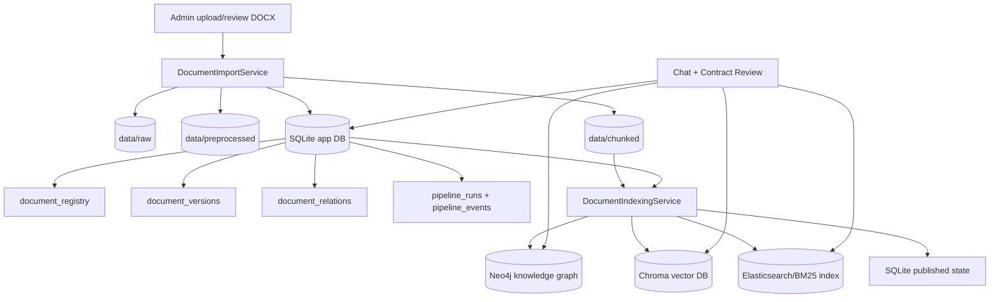
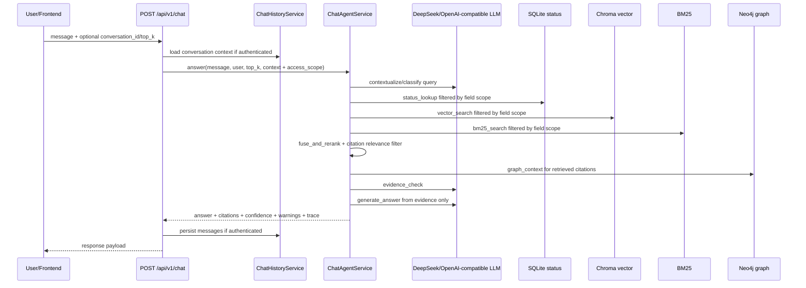
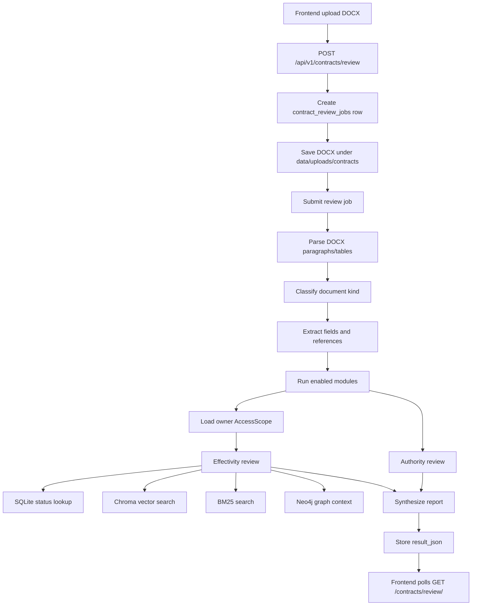

# Tong quan he thong Legal Chatbot AI

Tai lieu nay mo ta he thong theo huong top-down: bat dau tu muc tieu du lieu, sau do di qua frontend, backend va cuoi cung la kien truc LLM. Noi dung duoc viet theo trang thai code hien tai cua repo, khong mo ta cac tinh nang chua co nhu the da hoan chinh.

Hai tai lieu nen doc kem:

- `docs/BACKEND_OVERVIEW.md`: giai thich backend chi tiet theo module va ham.
- `docs/CHAT.md`: giai thich rieng `backend/services/chat_agent_service.py` va luong RAG/chat agent.

## 1. Thiet ke database va kho du lieu

He thong khong dung mot database duy nhat cho moi nhu cau. Thay vao do, no tach ro:

- SQLite: nguon trang thai chuan cua ung dung.
- Local filesystem: noi luu artifact goc va artifact trung gian.
- Chroma: vector database cho semantic search.
- Elasticsearch/BM25: lexical search index cho tim kiem theo tu khoa.
- Neo4j: knowledge graph cho cau truc van ban va quan he phap ly da duoc publish.

Su that can nhin thang: SQLite moi la canonical source of truth o tang app. Chroma, Neo4j va Elasticsearch/BM25 la cac index co the rebuild tu SQLite va artifact da luu. Neu mot index loi thoi diem publish, khong nen ket luan ngay du lieu goc mat; can xem `pipeline_runs`, `pipeline_events`, `document_versions` va `import_batch_id` truoc.

Moi document co `field_id` la so nguyen khong am. `field_id = 0` la public. Admin truy cap moi field; guest chi truy cap field 0; business user truy cap field 0 cong voi cac `allowed_field_ids` duoc admin cap. Quyen nay duoc enforce o backend, khong chi tren UI.



### 1.1. SQLite app database

SQLite luu cac bang chinh:

- `users`: tai khoan noi bo, gom `admin` va `business_user`.
- `user_field_permissions`: danh sach `field_id` ma tung business user duoc phep truy cap.
- `auth_sessions`: Bearer token duoc hash, thoi han, trang thai revoked.
- `chat_conversations`, `chat_messages`: lich su chat cua user da dang nhap, gom citation, confidence va metadata trace.
- `contract_review_jobs`: job upload DOCX va ket qua ra soat hop dong/van ban.
- `document_registry`: dinh danh on dinh cua van ban, metadata, `field_id`, trang thai publish va hieu luc.
- `document_versions`: version theo tung lan import/chinh sua, tro den raw DOCX, text da preprocess va JSON chunks.
- `document_relations`: quan he van ban do admin nhap/xac nhan hoac trich xuat duoc trong pipeline.
- `pipeline_runs`, `pipeline_events`: nhat ky import/publish/rollback, la noi can doc dau tien khi can chan doan loi pipeline.

Trong thiet ke nay, `import_batch_id` la toa do quan trong de noi mot lan import/publish voi artifact va index tuong ung.

Du lieu cu duoc migrate ve `field_id = 0` de khong lam mat quyen truy cap sau nang cap. Van ban moi co the vao review khi chua co `field_id`, nhung khong duoc publish cho den khi admin nhap field hop le.

### 1.2. File artifacts

Filesystem luu cac artifact ma SQLite chi tro den:

- `data/raw`: file DOCX goc cua van ban phap luat.
- `data/preprocessed`: text da trich xuat tu DOCX.
- `data/chunked`: chunk JSON da chuan hoa theo dieu/khoan va metadata.
- `data/uploads/contracts`: file DOCX do nguoi dung upload de ra soat hop dong.

Khi delete/rollback, service khong nen xoa tuy tien. Code hien tai co guard de chi xoa artifact trong cac thu muc quan ly.

### 1.3. Vector database: Chroma

Chroma luu dense embedding cho cac chunk da publish. Vai tro cua no la semantic retrieval: tim doan van gan nghia voi cau hoi, ke ca khi tu khoa khong trung khop hoan toan.

Trong publish pipeline, `ChromaVectorProvider.index_chunks()` nhan chunks da validate va ghi vao collection cau hinh boi `CHROMA_PATH` va `CHROMA_COLLECTION`. Chat agent doc Chroma qua `ChromaVectorRetriever`.

Gioi han can ghi nho: Chroma khong tu quyet dinh van ban nao la active, expired hay thay the. Cac bo loc do phu thuoc vao metadata da publish tu SQLite/chunk payload.

Sau publish, metadata Chroma phai co `field_id`. Neu gap index legacy thieu `field_id`, retriever coi missing value la `0` de tuong thich nguoc, nhung document doi field khac can re-publish de cap nhat index.

### 1.4. Knowledge graph: Neo4j

Neo4j la graph index cho hai lop tri thuc:

- Cau truc van ban: document, article, clause/chunk va lien ket noi bo giua chung.
- Quan he phap ly cap van ban: sua doi, thay the, bai bo, lien quan... khi quan he nay da duoc admin nhap/xac nhan hoac co trong du lieu publish.

`Neo4jGraphWriter` ghi graph trong publish pipeline. `FixedNeo4jContextRetriever` doc graph de bo sung context cho chat va ra soat hieu luc.

Node document/article/clause trong Neo4j cung mang `field_id`; graph context khong duoc tra quan he toi target document ngoai access scope neu target resolve duoc.

Su that de tranh ao tuong: graph khong nen duoc mo ta nhu mot he thong tu suy luan quan he phap ly day du. Neu relation data khong co, he thong khong duoc bia ra quan he cap 1/cap 2 de lap khoang trong.

### 1.5. Elasticsearch/BM25

Elasticsearch/BM25 la lexical search index. No bo sung cho Chroma trong cac cau hoi co so hieu, dieu khoan, cum tu phap ly chinh xac, hoac noi dung can match theo keyword.

Trong chat, ket qua BM25 va vector duoc hop nhat/rerank de tang co hoi lay dung can cu.

Document trong Elasticsearch/BM25 cung mang `field_id`; query them filter theo field khi co the va van post-filter o backend de tranh ro ri.

## 2. Frontend

Frontend hien tai la React/Vite, entrypoint route nam trong `frontend/src/App.jsx`. Cac API call di qua `frontend/src/services/api.js`, mac dinh base path `/api/v1` va tu dong gan Bearer token neu co.

### 2.1. Auth va route protection

`AuthContext` quan ly:

- token trong `localStorage`;
- user hien tai tu `/auth/me`;
- login/logout;
- guest mode khong co token.

`ProtectedRoute` dieu huong theo role:

- `admin`: vao khu admin.
- `business_user`: dung chat, profile, legal drafting, contract review.
- `guest`: duoc vao home/chat neu route `allowGuest`, nhung khong co persisted backend session.

Guest mode la anonymous va ephemeral. Guest chat co the goi backend chat, nhung khong luu lich su conversation vao SQLite vi khong co user/token.

### 2.2. Cac trang nguoi dung

- `/login`: dang nhap bang username/password, hoac vao guest mode.
- `/`: home cho business user/guest; admin se duoc redirect ve `/admin`.
- `/chat`: giao dien chat voi legal assistant; user da dang nhap co sidebar conversation history, guest chi chat tam thoi.
- `/profile`: trang profile cua business user. Can luu y code frontend co form doi mat khau goi `/auth/change-password`, nhung backend route hien tai chua thay endpoint nay.
- `/legal-drafting`: UI tao ban thao van ban/hop dong va fallback preview o client. Code hien tai goi `/draft/document` hoac `/draft/contract`, nhung backend route tuong ung chua thay trong repo, nen khong nen mo ta day la tinh nang backend hoan chinh.
- `/contract-review`: upload DOCX de ra soat tham quyen/hieu luc/rui ro so bo; trang nay goi backend that qua `/contracts/review` va poll job result.

### 2.3. Cac trang admin

Admin layout gom sidebar va cac route con:

- `/admin`: dashboard, tong hop documents/users tu API admin.
- `/admin/import`: upload mot hoac nhieu DOCX vao import pipeline.
- `/admin/documents/published`: danh sach van ban da publish.
- `/admin/documents/review`: danh sach van ban can review/chua publish; metadata tab cho admin nhap `field_id` dang number `min=0`.
- `/admin/users`: tao/sua user, doi role, khoa/mo khoa tai khoan, cap `allowed_field_ids` cho business user.
- `/admin/profile`: profile dang nhung trong admin layout.
- `/admin/chat`: chat trong admin context.

`DocumentsPage` la man hinh quan trong nhat trong admin: xem detail, metadata, chunks, relations, download raw DOCX, publish, delete va theo doi pipeline publish.

## 3. Backend top-down

Backend la Flask app. Entry point chinh la `backend/app.py`.

```text
create_app()
  -> Config.from_env()
  -> init_db()
  -> seed_admin_user()
  -> register auth/admin/chat/contracts blueprints
  -> expose /api/v1/health
```

### 3.1. Config va bootstrap

`Config.from_env()` doc cac bien cau hinh:

- SQLite path.
- admin seed user.
- Neo4j URI/user/password/database.
- Chroma path/collection.
- Elasticsearch/BM25 config.
- LLM model/config.
- chat agent mode, timeout, memory setting.
- contract review module config path.

`init_db()` tao schema va ap dung migration nho de database cu van chay duoc. `seed_admin_user()` tao admin dau tien khi env co `ADMIN_USERNAME` va `ADMIN_PASSWORD`.

### 3.2. Auth module

Public/auth endpoints:

```text
POST /api/v1/auth/login
POST /api/v1/auth/logout
GET  /api/v1/auth/me
```

`AuthService` xu ly:

- validate username/password;
- hash password bang Werkzeug;
- tao session token va luu `sha256(token)` vao `auth_sessions`;
- lay user tu Bearer token;
- revoke session khi logout;
- admin create/update user, bao ve rule khong de mat active admin cuoi cung;
- validate `allowed_field_ids` la danh sach so nguyen khong am, dedupe va tra field nay trong login/me/list users. Admin duoc coi la all fields nen khong can luu permission row.

### 3.3. Admin document module

Admin endpoints chinh:

```text
GET    /api/v1/admin/users
POST   /api/v1/admin/users
PATCH  /api/v1/admin/users/<user_id>
POST   /api/v1/admin/documents/import
GET    /api/v1/admin/documents
GET    /api/v1/admin/documents/<document_id>
GET    /api/v1/admin/documents/<document_id>/download
PATCH  /api/v1/admin/documents/<document_id>/metadata
PATCH  /api/v1/admin/documents/<document_id>/chunks
PUT    /api/v1/admin/documents/<document_id>/relationships
DELETE /api/v1/admin/documents/<document_id>
POST   /api/v1/admin/documents/<document_id>/publish
GET    /api/v1/admin/pipeline
GET    /api/v1/admin/pipeline/<run_id>
POST   /api/v1/admin/pipeline/<run_id>/rollback
```

`DocumentImportService` phu trach import/review/versioning/chunking:

```text
import_document()
  -> create pipeline run + import_batch_id
  -> validate DOCX
  -> save raw DOCX
  -> extract_docx()
  -> extract_metadata_hints()
  -> parse metadata from form + hints + optional LLM fallback
  -> validate optional field_id if form provides it
  -> upsert document_registry
  -> write preprocessed text
  -> build normalized metadata
  -> chunk text by LLM splitter or regex fallback
  -> validate chunks
  -> write chunk JSON
  -> store document_versions + document_relations
  -> mark ready_for_review
```

`field_id` la publish blocker bat buoc: missing, am hoac khong phai so nguyen thi van ban van o `ready_for_review`. Gia tri `0` hop le va nghia la public. Khi metadata `field_id` thay doi, service rewrite chunk JSON de lan publish tiep theo day dung field vao Chroma/BM25/Neo4j.

`DocumentIndexingService` phu trach publish/rollback/delete:

```text
enqueue_publish_document()
  -> validate latest ready_for_review version
  -> create queued publish pipeline
  -> run publish job in background

run_publish_pipeline()
  -> load chunk JSON
  -> validate + normalize chunks
  -> load relations
  -> carry field_id into ChunkRecord/index metadata
  -> index Neo4j
  -> index Chroma
  -> index Elasticsearch/BM25
  -> unpublish old batches
  -> mark SQLite published
  -> mark pipeline published
```

Rollback/delete di theo `import_batch_id`, cleanup index truoc, sau do cap nhat SQLite va artifact lien quan.

### 3.4. Chat module

Chat endpoints:

```text
POST /api/v1/chat
GET  /api/v1/chat/conversations
GET  /api/v1/chat/conversations/<conversation_id>
```

`ChatHistoryService` nam trong `backend/api/chat_routes.py` va xu ly:

- tao conversation moi neu user dang nhap gui chat khong co `conversation_id`;
- them message user/assistant;
- luu citations/confidence/metadata JSON;
- lay recent messages va summary de lam conversation memory;
- format message khi tra ve frontend;
- redact assistant message/citation cu neu user khong con duoc phep truy cap field cua citation do.

Route chat cho phep optional auth. Neu co token hop le, backend luu history. Neu khong co token, backend tra answer payload ngay va khong tao conversation.

Chat route tinh `AccessScope` tu user hien tai: admin unrestricted, guest `{0}`, business `{0} + allowed_field_ids`. Scope nay duoc truyen vao `ChatAgentService` va conversation context.

### 3.5. Contract review module

Contract endpoints:

```text
POST /api/v1/contracts/review
GET  /api/v1/contracts/review/<job_id>
```

`ContractReviewAgentService` tao job, luu DOCX upload vao `data/uploads/contracts/<job_id>`, validate DOCX archive, sau do chay review job qua executor mot worker. Ket qua duoc luu vao `contract_review_jobs.result_json`.

Contract review lay quyen field cua job owner tai runtime. Effectivity module dung cung access scope khi tra status, vector, BM25 va graph. Neu hop dong vien dan van ban ngoai scope, finding nen la `insufficient_data` thay vi lo citation.

Module hien co ho tro hai nhom review:

- `authority`: kiem tra chu the, nguoi ky, co quan/chuc danh theo rules neu co.
- `effectivity`: tim van ban duoc vien dan, tra metadata hieu luc/quan he da publish va tao finding neu du lieu thieu hoac co rui ro.

## 4. Kien truc LLM va agent

Phan LLM nen duoc nhin rieng voi backend CRUD. Backend cung cap API, state va index; LLM/agent moi la lop dieu phoi truy van, danh gia evidence va sinh output.

### 4.1. Chat/RAG flow



`ChatAgentService.answer()` khoi tao state gom trace id, role, top_k, filters, warnings, memory, agent steps va tool trace. Neu `CHAT_AGENT_MODE=react`, service thu dung ReAct tool-calling. Neu ReAct khong san sang, timeout hoac loi, service fallback ve pipeline co dinh.

State cung co `access_scope`. Tat ca tool `status_lookup`, `vector_search`, `bm25_search`, `graph_context` va `get_chunk_detail` chi lam viec tren evidence nam trong scope. Chroma/BM25 co filter metadata khi co the, sau do backend van post-filter bang `field_id` truoc khi fuse/rerank.

Pipeline co dinh:

```text
contextualize_query
  -> route_intent
  -> resolve_exact_status
  -> decide_status_sufficiency
  -> vector_retrieve
  -> bm25_retrieve
  -> fuse_and_rerank
  -> citation_relevance_filter
  -> graph_enrich
  -> evidence_check
  -> generate_output
```

Tool cua ReAct phase:

- Retrieval phase: `status_lookup`, `vector_search`, `bm25_search`.
- Expansion phase: `graph_context`, `get_chunk_detail`.

Nguyen tac quan trong:

- LLM classification khong tra loi cau hoi, chi dinh tuyen intent.
- LLM evidence check chi danh gia evidence da retrieve, khong them fact moi.
- LLM answer generation chi duoc dung evidence/citation/status/graph context duoc cung cap.
- Khi thieu retriever, thieu LLM, thieu citation hoac confidence thap, service tra warning/insufficient evidence thay vi bia can cu.
- Access control la tien dieu kien truoc evidence check: LLM khong duoc nhin thay citation ngoai scope.

### 4.2. Contract review flow



Contract review hien tai khong phai mot LLM chat tu do. No giong agent/rule pipeline hon:

- parse DOCX;
- detect kind la contract, legal document hoac unknown;
- extract parties, signatures, issuing body, signer title, referenced documents, legal citations;
- chay module `authority` va `effectivity`;
- voi effectivity, truy van metadata/status da publish va bo sung context tu vector/BM25/graph;
- moi truy van effectivity deu loc theo field scope cua job owner;
- tong hop `risk_summary`, `modules`, `section_reviews`, `citations`, `warnings`, `tool_trace`.

Gioi han can noi ro: article-level effectivity chua co du lieu rieng tru khi co evidence sua doi/thay the theo dieu khoan. Vi vay finding co the ket luan trang thai cap van ban nhung van ghi `article_status = insufficient_data`.

## 5. Luong nguoi dung tu dau den cuoi

### 5.1. Admin dua van ban phap luat vao he thong

```text
Admin login
  -> /admin/import
  -> upload DOCX
  -> backend parse metadata/chunks/relations
  -> document becomes ready_for_review
  -> admin review metadata/chunks/relations and set field_id
  -> publish
  -> Neo4j + Chroma + BM25 indexed
  -> SQLite marks active published version
  -> chat/contract review can retrieve it
```

### 5.2. User hoi dap phap ly

```text
User opens /chat
  -> sends question
  -> backend builds conversation context if logged in
  -> chat agent retrieves status/vector/BM25/graph evidence within field scope
  -> LLM generates Vietnamese answer with citations/warnings
  -> authenticated user history is persisted
```

### 5.3. User ra soat hop dong

```text
User opens /contract-review
  -> uploads DOCX
  -> backend creates queued job
  -> parser + modules analyze authority/effectivity
  -> effectivity retrieval uses owner field scope
  -> frontend polls until completed/failed
  -> user reads risk summary, findings, citations and tool trace
```

## 6. Cac diem can canh giac khi phat trien tiep

- Dung coi Chroma/Neo4j/BM25 la database goc. Khi co loi, doc SQLite pipeline history truoc.
- Dung mo ta knowledge graph nhu he thong tu dong suy luan moi quan he phap ly neu admin/source chua cung cap relation.
- Dung mo ta Legal Drafting la backend feature hoan chinh khi route `/draft/document` va `/draft/contract` chua co trong backend hien tai.
- Dung bo qua guest mode: guest co the chat nhung khong co persisted history, profile hay account state.
- Dung dua field access vao frontend-only logic. Backend phai la noi enforce `field_id`, va index legacy thieu `field_id` chi nen fallback public `0` de tuong thich nguoc.
- Dung xoa artifact/index theo filename cam tinh; can di theo `document_id`, `version`, `import_batch_id` va pipeline state.
- Dung de LLM sinh can cu ngoai evidence. Voi legal domain, `insufficient_evidence` tot hon cau tra loi co ve tu tin nhung khong co citation.
